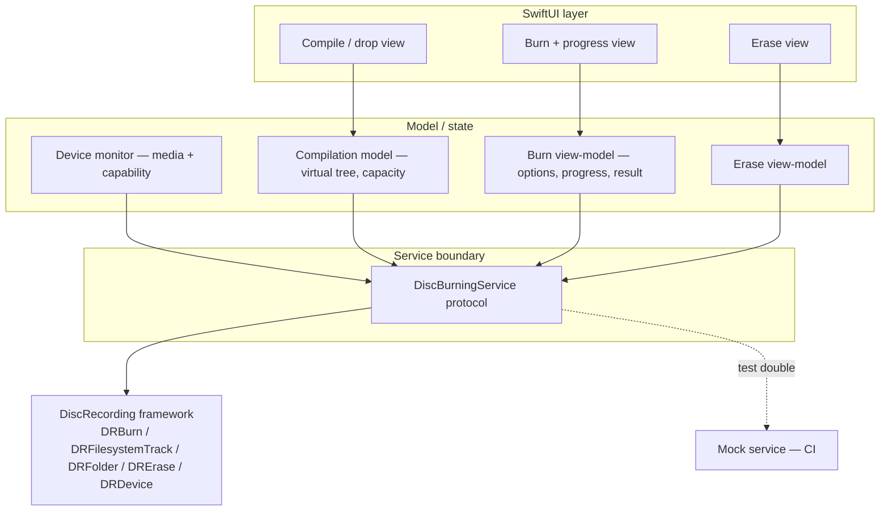
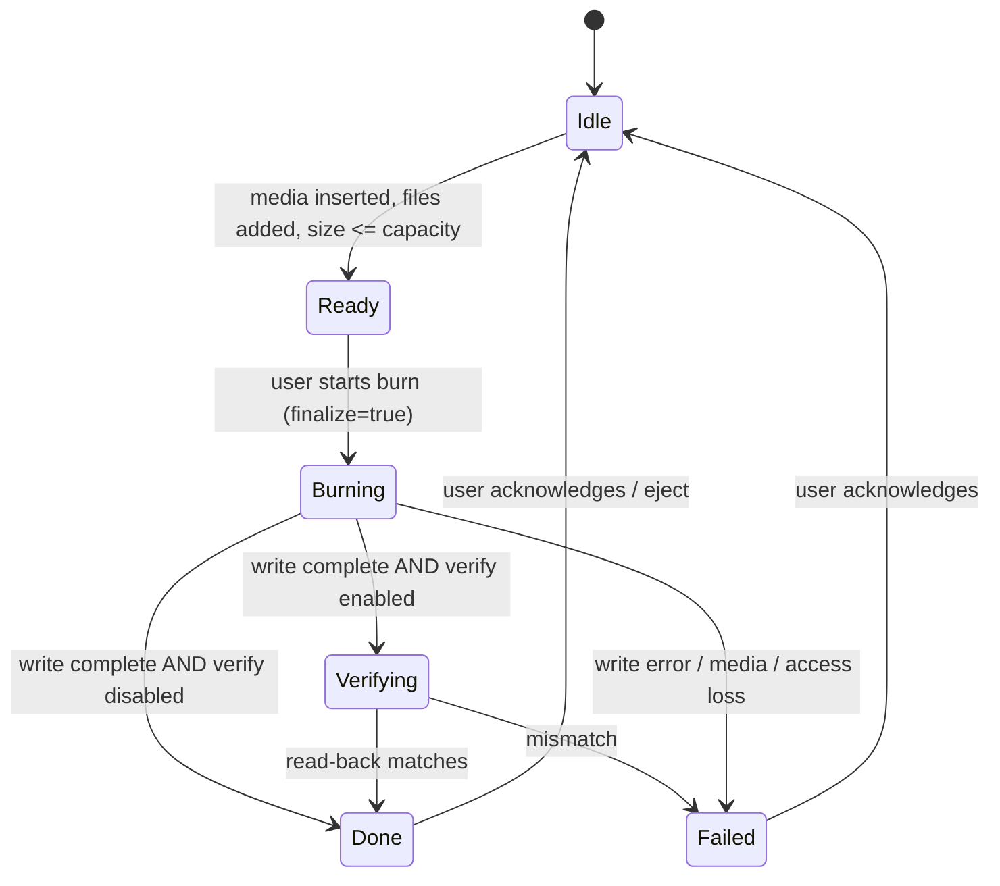

# Blu-ray Data Burner - Plan

**Product Contract preservation:** changed R7 (MVP finalizes discs only; the appendable choice is deferred) and R8 (deferred entirely). Multisession is deferred to post-MVP follow-up per user direction during planning. All other Product Contract requirements and IDs are unchanged.

---

## Goal Capsule

- **Objective:** A lean, native macOS (Sequoia 15+) app that burns data discs to CD/DVD/Blu-ray — drag files in, hit write, get a cross-platform-readable disc — using Apple's DiscRecording framework, as the focused, cheap alternative to bloated paid burning suites.
- **Product authority:** Solo owner (product + build). Paid app.
- **Execution profile:** Greenfield Swift + SwiftUI macOS app. No existing code. Deep plan, phased delivery.
- **Stop condition / first gate:** U1 (sandbox burn spike) decides whether the Mac App Store is reachable. Everything downstream assumes a sandboxed-from-the-start architecture; if the spike fails, distribution narrows to direct-only (see KTD4).

---

## Product Contract

### Summary

A macOS Sequoia+ app that writes data discs (CD, DVD, Blu-ray) from files dragged in from Finder, using Apple's native burning framework and the UDF filesystem so the result reads on macOS, Windows, and Linux without extra software. v1 covers compile-and-burn with a finalize-or-appendable choice, an optional verify-after-burn pass, erasing rewritable media, and burning existing disc images. Sold as a paid app through both the Mac App Store and direct download.

### Problem Frame

Burning a plain data Blu-ray on macOS today means buying an expensive suite bundled with authoring, catalog, and conversion features that a user who just wants to write files to a disc will never touch — bloatware wrapped around a small need. The one credible open-source option is years stale. The gap is a small, fast, native tool that does data burning well and nothing else, and produces discs that are trustworthy for archival and readable on any modern OS.

### Key Decisions

- **Native DiscRecording framework, no third-party engine.** Apple ships a public CD/DVD/Blu-ray burning framework that also builds the on-disc filesystem. Using it directly is what keeps the app small, fast, and free of bundled dependencies — the core premise of the product.
- **UDF as the filesystem backbone.** UDF is the only widely-supported format that mounts natively on macOS, Windows, and Linux, handles files larger than 4 GB, and is the Blu-ray standard. ISO 9660 fails the first two, so UDF governs. For CD media specifically, v1 additionally writes an ISO 9660/Joliet bridge alongside UDF so CDs stay readable on older systems and consumer appliances.
- **Multisession with a per-burn finalize choice, sequenced finalize-first.** Discs are appendable by default with an explicit "finalize now" option. Multisession is the largest complexity driver in the product, so the build should land the finalize-and-close path first and layer appendability on top rather than attempting both at once.
- **Design to App Sandbox rules across the whole codebase.** Shipping both an App Store (sandboxed) and a direct (Developer ID) build from one codebase means the stricter sandboxed access model — security-scoped bookmarks for user-selected files, optical-burning entitlements — governs even the non-sandboxed build.

### Requirements

**Compilation and burning**
- R1. Burn a user-assembled set of files and folders to CD-R, DVD±R, and BD-R / BD-R DL media as a data disc.
- R2. Users assemble a burn by dragging files and folders in from Finder, then trigger a single write action.
- R3. Preserve original filenames, folder hierarchy, and file contents byte-for-byte on the resulting disc.

**Cross-platform compatibility**
- R4. Write discs in UDF so they mount and read natively on macOS, Windows, and Linux with no additional software.
- R5. Support individual files larger than 4 GB, up to the media's capacity.
- R6. For CD media, additionally write an ISO 9660/Joliet bridge alongside UDF so CDs remain readable on older systems and consumer appliances.

**Disc lifecycle and management**
- R7. Before writing, let the user choose to finalize the disc (closed to further sessions) or leave it appendable.
- R8. When an appendable disc with existing sessions is inserted, show its current contents and let the user add a new session until the disc is finalized or full.
- R9. After writing, optionally run a verification pass that reads the disc back, compares it against the source, and reports any mismatch.
- R10. Erase or reformat rewritable media (CD-RW, DVD-RW/+RW, BD-RE) so it can be reused.
- R11. Burn an existing disc image file (`.iso`, `.dmg`, `.img`) to disc verbatim.
- R12. Before writing, show the assembled set's total size against the target disc's capacity, and block the burn when it exceeds capacity (spanning across discs is out of scope for v1).

**Distribution and packaging**
- R13. Ship as a single native macOS app supporting macOS Sequoia (15) and later.
- R14. Distribute through both the Mac App Store (sandboxed) and direct download (Developer ID signed and notarized) from one codebase.
- R15. Sell as a paid app: the App Store build uses Apple's payment and update path; the direct build carries its own licensing and auto-update.

**Non-functional and architecture**
- R16. Use Apple's DiscRecording framework as the burning and filesystem engine; bundle no third-party burning library.
- R17. Keep the app scoped to data burning — no media authoring, no library/catalog, no auxiliary utilities.
- R18. Stream the burn at the drive's rated write speed, avoiding an unnecessary full-disc intermediate image where the framework supports direct writing.
- R19. Operate correctly under App Sandbox — security-scoped bookmarks for user-selected files and the required optical-burning entitlements — and apply the same access model in the direct build.

### Scope Boundaries

**MVP scope (this plan's active units)**
- Finalized (closed) data-disc burns to CD/DVD/BD, with UDF (+ ISO 9660/Joliet bridge on CD), capacity check, optional verify, erase, and disc-image burning.

**Deferred to Follow-Up Work** (planned, later PRs — not this MVP)
- Multisession / appendable discs: the appendable half of R7 and all of R8 (reading back and merging prior sessions' file trees). Deferred per user direction; the framework offers no documented session-merge API, so this carries its own spike (see Open Questions).
- Physical-burn runbook execution across the full media matrix (the runbook itself is authored in U10; repeated hardware validation is ongoing manual work).

**Deferred for later** (from brainstorm — beyond v1)
- Disc spanning across multiple discs when a set exceeds one disc.

**Outside this product's identity**
- Media library / catalog management, transcoding, or format conversion.
- Ripping or disc-to-disc copying.
- Backup scheduling or cloud sync.
- Audio CD, Video DVD, and Blu-ray Video authoring.

---

## Planning Contract

### Key Technical Decisions

- KTD1. **Swift + SwiftUI app shell; DiscRecording behind a mockable service protocol.** The app is SwiftUI (native, minimal, Sequoia-era). All DiscRecording access is wrapped in a thin Swift service layer defined by a protocol (e.g., a `DiscBurningService`), so the UI/model tier depends on the protocol, not the framework. This is what makes the logic testable in CI (KTD6) without hardware.
- KTD2. **UDF backbone + automatic ISO 9660/Joliet hybrid on CD.** DiscRecording builds a hybrid disc automatically from a single track layout; per-object filesystem name dictionaries (`kDRUDF`, `kDRISO9660`, `kDRJoliet`) control naming. UDF is written for all media; the ISO 9660/Joliet bridge is populated for CD media so a single burn produces the bridge (R4, R6). Confirmed feasible in research.
- KTD3. **Virtual `DRFolder`/`DRFile` tree over real files — stream at burn time, no pre-staged image.** The compilation references on-disk files via `DRFile fileWithPath:`; the engine pulls data on demand during the burn (R18). Consequence: the app must hold access to every referenced file for the entire burn, not just at selection time (drives KTD4's bookmark handling).
- KTD4. **Design to App Sandbox from the start, gated by the U1 spike.** The Mac App Store requires sandboxing, and the burn engine runs out-of-process, so whether it can read the app's security-scoped files is unverified and decisive. U1 proves this before architecture is committed. On success: sandboxed-from-the-start with security-scoped bookmarks held across the burn — one build serves both App Store and direct (R14, R19). On failure: the App Store is not reachable; ship direct-only, non-sandboxed — in that build, reference files by plain URL/path with no security-scoped start/stop bracketing (there are no bookmarks to hold). The security-scoped bookmark handling in U4–U6 is therefore conditional on the U1 go path; R19's "same access model in the direct build" applies only when the go path keeps the app sandboxed. No dedicated optical entitlement exists, so U1 also determines which `com.apple.security.*` entitlements (if any) are actually required.
- KTD5. **MVP burns finalized discs only.** Set `DRBurnAppendableKey` = false (closed disc). The appendable path and session readback are deferred (R7 partial, R8).
- KTD6. **Test strategy: mock the framework boundary; validate hardware by runbook.** Real burns need physical media and cannot run in CI. Unit tests cover the mockable core — filesystem-tree construction, capacity math, media-type/capability detection, and view-model state — against the KTD1 protocol. Actual burn/verify/erase are validated by a manual runbook (U10) on real CD/DVD/BD hardware.
- KTD7. **Built-in verify and erase.** Verify is a burn property (`DRBurnVerifyDiscKey`); erase is `DRErase` with `DREraseTypeKey` (quick/complete). No custom read-back or erase machinery is needed (R9, R10).

### High-Level Technical Design

Component structure — the UI and model tiers depend only on the `DiscBurningService` protocol; the concrete implementation wraps DiscRecording, and a mock implementation backs the tests:

Burn lifecycle — the state a burn moves through, surfaced to the UI via the service's progress callbacks (DiscRecording drives this via `DRNotificationCenter`):

### Assumptions

- DiscRecording's out-of-process burn engine can read files that a sandboxed app authorized via security-scoped bookmarks. **Decisive and unverified — U1 validates it; it gates the Mac App Store goal.**
- DiscRecording is functional and non-deprecated on macOS 15 Sequoia (present in the SDK, docs removed years ago, not marked deprecated). Validate by building and running on a 15.x machine (U2).
- DiscRecording drives standards-compliant external USB DVD/BD writers generically, not just Apple hardware (supported by header interconnect constants and Finder behavior).
- BD-R DL is reported as `DRDeviceMediaTypeBDR` with a larger capacity (no dedicated DL constant). Validate with physical DL media in the runbook.

### Sequencing

Phased. Phase A de-risks and scaffolds; Phase B is the core burning MVP; Phase C adds the self-contained adjacent features; Phase D ships. U1 is a hard gate before Phase B commits to a sandboxed architecture.

---

## Implementation Units

### Phase A — De-risk and foundation

### U1. Sandbox burn spike (architecture gate)
- **Goal:** Prove — or disprove — that a sandboxed macOS app can burn a data disc from files it accessed via security-scoped bookmarks, using DiscRecording. This is the go/no-go for Mac App Store distribution.
- **Requirements:** R14, R19 (de-risks); unblocks KTD4.
- **Dependencies:** none.
- **Files:** `Spike/SandboxBurnSpike/` (throwaway Xcode target — not shipped), `Spike/README.md` (findings + go/no-go writeup).
- **Approach:** Minimal sandboxed app with App Sandbox enabled. Acquire files via **both** sandbox grant mechanisms and test each against the burn engine: (a) a **Finder drag-and-drop** drop target — the path the shipping app actually uses (U5) — and (b) `NSOpenPanel` (Powerbox). For each, persist a security-scoped bookmark, start-accessing, build a tiny `DRFolder`/`DRFile` tree referencing the real files (include a **dropped folder with child files** to test recursive access), run a real `DRBurn` to a blank disc, and observe whether the out-of-process engine reads the files or fails with a permission/read error. Record which entitlements (if any) were required; test with and without `com.apple.security.device.usb`.
- **Execution note:** This is a spike, not production code — optimize for a fast, honest answer. Run it before U3+ commit to the sandboxed design. Requires physical hardware and a blank disc.
- **Test expectation:** none — throwaway spike; the deliverable is the go/no-go writeup, not tests.
- **Verification:** `Spike/README.md` states clearly whether sandboxed burning works, with the exact entitlement set, and a go/no-go for the Mac App Store. The go decision **requires the drag-and-drop path to pass** (that is what R2/U5 depend on); an NSOpenPanel-only pass is not sufficient. If no-go, KTD4's fallback (direct-only) is recorded as the path.

### U2. Xcode project and DiscRecording integration
- **Goal:** Create the shippable app skeleton: SwiftUI macOS app, Sequoia 15 minimum, DiscRecording linked, entitlements and signing scaffold, the `DiscBurningService` protocol seam, and a mock implementation for tests.
- **Requirements:** R13, R16; establishes KTD1.
- **Dependencies:** U1 (adopt its entitlement findings).
- **Files:** `BluRayBurner.xcodeproj`, `BluRayBurner/App.swift`, `BluRayBurner/Services/DiscBurningService.swift` (protocol), `BluRayBurner/Services/DiscRecordingService.swift` (concrete, thin), `BluRayBurner/Services/MockDiscBurningService.swift`, `BluRayBurner/BluRayBurner.entitlements`, `BluRayBurnerTests/MockDiscBurningServiceTests.swift`.
- **Approach:** Define the protocol surface the app needs (enumerate devices/media, build a compilation, run a burn with options + progress callback, erase). Concrete implementation is a thin DiscRecording wrapper; keep framework types from leaking past the protocol. Confirm the framework links and a trivial call runs on Sequoia (validates the health assumption).
- **Patterns to follow:** none (greenfield); mirror standard SwiftUI `App`/`Scene` structure.
- **Test scenarios:** Mock conforms to the protocol and is injectable. `Test expectation: minimal` — one test asserting the app builds against the mock and the protocol is satisfiable; framework link-check is manual.
- **Verification:** Project builds and runs an empty window on macOS 15; DiscRecording symbol resolves; tests run against the mock in CI.

### Phase B — Core burning MVP

### U3. Device and media detection
- **Goal:** Detect connected optical burners and the inserted media: type (CD-R, DVD±R, BD-R/RE), writable capability, and capacity; react live to insertion/removal.
- **Requirements:** R1 (media targeting), R12 (capacity source).
- **Dependencies:** U2.
- **Files:** `BluRayBurner/Model/OpticalDevice.swift`, `BluRayBurner/Model/DiscMedia.swift`, `BluRayBurner/Model/DeviceMonitor.swift`, `BluRayBurnerTests/DeviceMonitorTests.swift`.
- **Approach:** Wrap `DRDevice` enumeration and the media status dictionary behind the service protocol; expose a Swift `DiscMedia` value (type, capacity bytes, blank?, appendable?, writable-capabilities). Drive live updates from `DRNotificationCenter` device/media notifications, surfaced as an observable stream the UI binds to.
- **Test scenarios:** Given a mock service reporting a blank BD-R at 25 GB → model exposes type=BD-R, capacity=25 GB, blank=true. Given media removed → model clears to no-media. Given a read-only drive/media → writable=false. Given BD-R DL capacity → surfaced as BD-R with the larger capacity (assumption). `Test expectation:` covers the mapping logic; live hardware notification is runbook-validated.
- **Verification:** Inserting/removing media in the mock updates the observable model; capability flags map correctly.

### U4. Burn compilation and filesystem model
- **Goal:** Turn a set of dragged files/folders into a burnable compilation: a virtual tree referencing real on-disk paths, total size, capacity check against the target media, and the UDF (+ CD ISO/Joliet bridge) filesystem configuration.
- **Requirements:** R1, R3, R4, R5, R6, R12; KTD2, KTD3.
- **Dependencies:** U2, U3.
- **Files:** `BluRayBurner/Model/Compilation.swift`, `BluRayBurner/Model/CompilationItem.swift`, `BluRayBurner/Services/FilesystemLayoutBuilder.swift`, `BluRayBurnerTests/CompilationTests.swift`, `BluRayBurnerTests/FilesystemLayoutBuilderTests.swift`.
- **Approach:** Model the compilation as a tree of items (file or folder) each holding a security-scoped URL. The layout builder maps the tree to the service's virtual `DRFolder`/`DRFile` structure and sets filesystem name dictionaries: UDF always; ISO 9660 + Joliet names when the target is CD. Compute total size from the tree; compare against `DiscMedia.capacity`. Preserve names and hierarchy exactly (R3).
- **Technical design (directional):** capacity state is a pure function — `fits = compilation.totalBytes <= media.capacityBytes` — surfaced as `.underCapacity(freeBytes)` / `.exact` / `.overCapacity(overBy)`; the burn action is disabled unless not-over. Filesystem selection is a pure function of `media.type` (CD → UDF+bridge, DVD/BD → UDF).
- **Test scenarios:** Empty compilation → size 0, burn disabled. Nested folders → tree mirrors input hierarchy and names byte-for-byte (R3). File > 4 GB included → size math correct, no overflow (R5). Total just under / equal / over media capacity → `.underCapacity` / `.exact` / `.overCapacity(overBy)` respectively, burn enabled only when not over (R12). Target = CD → layout requests UDF + ISO 9660 + Joliet names; target = DVD/BD → UDF only (R4, R6). Duplicate filename in same folder → resolved/flagged deterministically.
- **Verification:** For representative trees the builder produces the expected virtual layout and filesystem set; capacity states are correct at the boundaries.

### U5. Drag-and-drop compile UI
- **Goal:** The main screen: drop files/folders from Finder, see the list and running total vs. capacity, remove items, pick verify/finalize options, and start the burn.
- **Requirements:** R2, R12 (surfacing); presents R9 toggle and the finalized-only MVP (KTD5).
- **Dependencies:** U3, U4.
- **Files:** `BluRayBurner/Views/CompileView.swift`, `BluRayBurner/Views/CapacityBar.swift`, `BluRayBurner/ViewModels/CompileViewModel.swift`, `BluRayBurnerTests/CompileViewModelTests.swift`.
- **Approach:** SwiftUI drop target accepting file URLs; on drop, obtain security-scoped access and add to the compilation. Show item list with remove; a capacity bar showing used vs. total with over-capacity styling; a verify-after-burn toggle; a burn button gated on `not over-capacity AND writable media present`. MVP shows finalized-only (no appendable control yet — KTD5).
- **Test scenarios:** Dropping file URLs adds them to the compilation (via view-model, mock service). Removing an item updates size and capacity state. Over-capacity → burn button disabled and overage shown. No writable media → burn disabled with a clear reason. Verify toggle state flows into burn options. `Test expectation:` view-model logic tested; pixel layout is manual.
- **Verification:** Interacting via the view-model produces correct enable/disable and capacity states; manual UI smoke shows drops and the capacity bar working.

### U6. Burn execution, verify, and progress
- **Goal:** Execute a finalized data-disc burn with optional verify, streaming from the virtual tree, reporting live progress and a clear success/failure result — holding file access for the whole burn.
- **Requirements:** R1, R3, R4, R5, R6, R9, R18, R19; KTD3, KTD5, KTD7.
- **Dependencies:** U4, U5.
- **Files:** `BluRayBurner/Services/DiscRecordingService.swift` (burn path), `BluRayBurner/ViewModels/BurnViewModel.swift`, `BluRayBurner/Views/BurnProgressView.swift`, `BluRayBurnerTests/BurnViewModelTests.swift`.
- **Approach:** Build the `DRFilesystemTrack` from U4's layout; configure `DRBurn` with `DRBurnAppendableKey=false` (finalize), `DRBurnVerifyDiscKey` from the toggle; start-accessing every security-scoped URL before the burn and stop only after completion/failure. Map `DRNotificationCenter` burn progress to the burn state (see HTD lifecycle) and surface percentage + phase (writing/verifying). Translate framework errors and access-loss into a `Failed` result with a readable reason; a verify mismatch is a failure, never a success (R9).
- **Execution note:** Prove the request/response contract of the service's burn method against the mock first (state transitions, verify-mismatch → failure), before wiring the real DiscRecording path.
- **Test scenarios:** Happy path (verify off) → states Ready→Burning→Done; result success. Happy path (verify on) → Ready→Burning→Verifying→Done. Verify mismatch (mock) → Verifying→Failed, result reports verification failure, not success (R9). Write error mid-burn (mock) → Burning→Failed with reason. Security-scoped access is started before burn and stopped after (assert start/stop bracketing). Progress callbacks update percentage monotonically. `Covers R9` on the verify-mismatch scenario.
- **Verification:** Full state machine exercised against the mock; manual runbook burns a real disc that mounts and reads on macOS/Windows/Linux with contents byte-identical.

### Phase C — Adjacent features

### U7. Erase rewritable media
- **Goal:** Erase CD-RW / DVD-RW/+RW / BD-RE from within the app (quick and complete), with progress.
- **Requirements:** R10; KTD7.
- **Dependencies:** U3.
- **Files:** `BluRayBurner/Views/EraseView.swift`, `BluRayBurner/ViewModels/EraseViewModel.swift`, `BluRayBurner/Services/DiscRecordingService.swift` (erase path), `BluRayBurnerTests/EraseViewModelTests.swift`.
- **Approach:** Wrap `DRErase` with `DREraseTypeKey` = quick/complete behind the service. Offer erase only when rewritable media is present; surface progress and a done/failed result.
- **Test scenarios:** Rewritable media present → erase offered; non-rewritable → hidden/disabled. Quick vs. complete flows through to the service call. Erase failure (mock) → Failed with reason. `Test expectation:` view-model logic; real erase is runbook-validated.
- **Verification:** Erase flow drives the correct service call per mode; manual erase of a real BD-RE succeeds and the disc reads blank.

### U8. Burn an existing disc image
- **Goal:** Select an `.iso`/`.dmg`/`.img` file and write it to disc verbatim, with capacity check, verify, and progress reusing the burn UI.
- **Requirements:** R11, R9, R12.
- **Dependencies:** U6.
- **Files:** `BluRayBurner/Views/ImageBurnView.swift`, `BluRayBurner/ViewModels/ImageBurnViewModel.swift`, `BluRayBurner/Services/DiscRecordingService.swift` (image-burn path), `BluRayBurnerTests/ImageBurnViewModelTests.swift`.
- **Approach:** Add a service call that burns from a disc image file rather than a compiled tree. Validate the image size against media capacity before writing; reuse U6's progress/verify/result handling.
- **Open detail (deferred to implementation):** the exact DiscRecording mechanism for a verbatim image burn (track produced from the image file) is settled during implementation against the framework — see Open Questions.
- **Test scenarios:** Image larger than media → blocked with overage (R12). Supported extensions accepted, others rejected. Verify toggle honored (R9). Burn failure (mock) → Failed with reason. `Test expectation:` selection/validation/state logic; real image burn is runbook-validated.
- **Verification:** Image selection and capacity gating behave correctly; manual burn of a real `.iso` produces a disc identical to the image.

### Phase D — Ship

### U9. Packaging and distribution
- **Goal:** Produce the two distribution builds from one codebase: direct (Developer ID signed, notarized, hardened runtime) and — if U1 was go — the sandboxed Mac App Store build. Wire the paid-app path per channel.
- **Requirements:** R13, R14, R15, R19; KTD4.
- **Dependencies:** U6 (a working core to ship); U1 (gates the MAS build).
- **Files:** `BluRayBurner/BluRayBurner.entitlements` (sandboxed, MAS), `BluRayBurner/BluRayBurner-Direct.entitlements` (direct), `docs/release/packaging.md`, `docs/release/distribution.md`.
- **Approach:** Two build configurations sharing one target. Direct: Developer ID + notarization + hardened runtime; auto-update mechanism (e.g. a Sparkle-style updater) and a licensing/payment path via a storefront. MAS: App Store provisioning + sandbox entitlements from U1; Apple handles payment/updates. If U1 was no-go, ship direct-only and record MAS as blocked.
- **Execution note:** This is mostly packaging/signing/config — prefer install and launch smoke verification (notarization passes, app launches from a signed DMG and, if applicable, from a MAS-style sandboxed build) over unit tests.
- **Test expectation:** none (packaging/config) — validated by notarization success and launch smoke checks.
- **Verification:** Direct build is notarized and launches from a signed DMG; if U1 go, the sandboxed build launches and can complete a burn; licensing/payment path documented per channel.

### U10. Physical-burn runbook and test matrix
- **Goal:** A repeatable manual runbook to validate real burns across the media the mocked tests can't cover, using the owner's DVD and Blu-ray burners.
- **Requirements:** validates R1, R3, R4, R5, R6, R9, R10, R11 on hardware; supports KTD6.
- **Dependencies:** U6, U7, U8.
- **Files:** `docs/testing/physical-burn-runbook.md`.
- **Approach:** Document a checklist covering: CD-R (UDF + ISO/Joliet bridge, verify cross-platform read), DVD±R, BD-R, BD-R DL (capacity), a >4 GB file, verify-after-burn (including an intentionally failed burn — via a deliberately unreadable source or, if the cancel affordance is added, a mid-burn cancel; otherwise physical interruption), erase of a CD-RW/DVD-RW/BD-RE, and an `.iso` image burn. Each row: media, action, and the pass criterion (mounts and reads byte-identically on macOS, Windows, and Linux where applicable). Note the owner has a DVD burner and a Blu-ray burner (the BD drive also reads/writes CD and DVD).
- **Test expectation:** none — this unit *is* the manual test procedure.
- **Verification:** The runbook exists, is followed once end-to-end, and each row passes or is logged with a defect.

---

## Verification Contract

| Gate | Applies to | Signal |
|---|---|---|
| Unit tests pass (mock service) | U2–U8 | `xcodebuild test` green; all view-model and model scenarios pass in CI without hardware |
| Build on Sequoia | U2 | App builds and runs on macOS 15; DiscRecording links |
| Sandbox spike resolved | U1 | `Spike/README.md` records a clear go/no-go for MAS with the required entitlements |
| Manual burn smoke | U6, U8 | A real disc burns, verifies, and reads byte-identically on macOS/Windows/Linux |
| Manual erase smoke | U7 | A real rewritable disc erases and reads blank |
| Notarization + launch | U9 | Direct build notarized and launches from a signed DMG; MAS build launches if U1 go |
| Runbook complete | U10 | Full media matrix walked once; results logged |

## Definition of Done

- U1 has produced a documented go/no-go; the architecture (sandboxed vs. direct-only) is committed accordingly.
- A user can drag files in, see size vs. capacity, and burn a finalized data disc to CD/DVD/BD that reads on macOS, Windows, and Linux with contents byte-identical (R1–R6, R12).
- Verify-after-burn reports mismatches as failures; erase and disc-image burning work (R9, R10, R11).
- All mockable logic is covered by passing CI tests; the physical runbook has been walked once across the owner's CD/DVD/BD hardware.
- Direct build is signed and notarized; the MAS build ships if and only if U1 was go; the paid-app path is wired per shipping channel (R13, R14, R15).
- Multisession/appendable (R7 appendable half, R8) is explicitly out of this milestone and recorded as follow-up.

---

## Open Questions

**Resolve during implementation**
- **Cancel affordance for an in-progress burn.** The MVP burn lifecycle exits `Burning` only to `Done` or `Failed` (engine error) — there is no user cancel. Decide whether to add a cancel action (a `Burning → Failed(cancelled)` transition in U5/U6 and the lifecycle diagram); a BD burn can run many minutes, so cancel is a reasonable MVP expectation. If not added, U10's aborted-burn row is exercised by physical interruption only.
- **`FilesystemLayoutBuilder` type boundary (U4).** Decide whether the builder emits framework-neutral layout descriptors (CI-testable; the concrete `DiscRecordingService` translates them into `DRFolder`/`DRFile`) or emits `DR*` types directly (its tests then link the framework and are exempt from KTD1's no-leak rule). KTD1 and U4's test scenarios favor the neutral-descriptor option; confirm before starting U4.

**Deferred to implementation**
- Exact DiscRecording mechanism for a verbatim disc-image burn (U8) — the track-from-image approach, settled against the framework during implementation.
- Whether to explicitly suppress individual filesystems (e.g., HFS+) on non-CD media or accept DiscRecording's default hybrid — research did not confirm an explicit per-filesystem on/off switch beyond populating name dictionaries.

**Deferred to the multisession follow-up (post-MVP)**
- The framework leaves a disc appendable via a flag, but exposes no documented API to read and merge prior sessions' file trees. The follow-up needs its own spike against the `DRDevice` media-status dictionary to determine whether true incremental multisession data discs are achievable, or whether "append" means a separate readable session only.

---

## Sources & Research

- DiscRecording framework headers (via the phracker/MacOSX-SDKs mirror): `DRBurn.h` (`DRBurnAppendableKey`, `DRBurnVerifyDiscKey`, `DRBurnOverwriteDiscKey`), `DRDevice.h` (`DRDeviceMediaTypeBDR`/`BDRE`, `DRDeviceCanWriteBDRKey`, USB/external interconnect constants), `DRContentProperties.h` (`kDRUDF`, `kDRISO9660`, `kDRJoliet`, `kDRHFSPlus`), `DRErase.h` (`DREraseTypeKey` quick/complete), `DRFile.h` (`fileWithPath:` on-demand streaming). Grounds KTD2, KTD3, KTD7 and the media/verify/erase units.
- Apple, *App Sandbox* entitlement list — no dedicated optical-burning entitlement exists (verified negative); temporary-exception entitlements are not accepted on the Mac App Store. Grounds KTD4 and the U1 gate.
- Apple, *Accessing files from the macOS App Sandbox* — security-scoped bookmarks; the out-of-process burn engine reading them is the decisive unknown behind U1.
- DiscRecording Swift API diffs (OS X 10.11) — confirms Swift usability; framework is present and non-deprecated but undocumented, so Sequoia health is validated by building (U2).
